# 🤖 Mob-Jarvis: The Ultimate AI Bridge
*Documentation for Website & Portfolio*

## 📚 Project Overview
**Mob-Jarvis** is a powerful hybrid AI ecosystem that bridges your Smartphone (Android) and your Workstation (Windows). It allows you to control your PC purely via voice commands from your phone, leveraging a seamless Cloud-Sync architecture. Unlike standard assistants, Jarvis executes complex system-level tasks on Windows (opening apps, typing, browsing) triggered remotely from anywhere.

---

## 🏗️ Architecture

### **The Hybrid-Cloud Bridge**
The system uses a **Client-Cloud-Server** architecture to ensure reliability and speed without needing complex port forwarding or static IPs.

1.  **Client (Android App):**
    *   **Role:** The "Ears" and "Remote".
    *   **Function:** Listens for voice commands, processes natural language, and determines if the task is local (Phone) or remote (PC).
    *   **Sync:** Uploads commands to **Google Firebase Firestore** in real-time.

2.  **The Cloud (Firebase Firestore):**
    *   **Role:** The "Message Queue".
    *   **Function:** Acts as a secure, real-time database that instantly synchronizes commands between the phone and PC.

3.  **Server (Windows PC Host):**
    *   **Role:** The "Hands" and "Engine".
    *   **Function:** A lightweight Python listener (`firebase_listener.py`) watches the cloud. When a command appears, it triggers the **Jarvis Engine** (`command.py`) to execute the task on Windows.

```mermaid
graph LR
    A[Android Phone 📱] -- "Vocal Input" --> B[Command Processor]
    B -- "Write Command" --> C((Firebase Cloud 🔥))
    C -- "Real-time Sync" --> D[Python Host 💻]
    D -- "Execute" --> E[Windows System ⚙️]
```

---

## ✨ Key Features

### **📱 Mobile Capabilities (Android)**
*   **Voice Activation:** Seamless voice listening with UI feedback.
*   **Circle to Search:** Custom overlay allowing users to circle content on screen to search/analyze (similar to Google/Samsung implementation).
*   **Flashlight Control:** "Turn on flashlight" / "Turn off flashlight".
*   **Note Taking:** "Take a note..." saves local text files.
*   **App Management:** Opens installed apps via voice.
*   **System Info:** Batter level, WiFi status, Bluetooth status checks.

### **💻 PC Control (Remote)**
*   **Remote Launching:** "PC Open Notepad", "PC Open Chrome".
*   **Web Automation:** "PC Google Search [Query]", "PC Open YouTube".
*   **System Control:** Capability to expand to Shutdown, Restart, Volume control (extensible via engine).
*   **Universal Bridge:** Can execute ANY Python function defined in the PC engine.

---

## 🛠️ Technology Stack

### **Android (Client)**
*   **Language:** Kotlin
*   **Core APIs:**
    *   `SpeechRecognizer` (Voice Input)
    *   `AccessibilityService` (Overlay & Circle to Search)
    *   `MediaProjection` (Screen Capture)
    *   `Firebase Firestore SDK` (Cloud Sync)
    *   `OkHttp` (Legacy API calls)

### **Windows PC (Server)**
*   **Language:** Python 3.10+
*   **Core Libraries:**
    *   `firebase-admin` (Database Connection)
    *   `pyautogui` (UI Automation)
    *   `subprocess` (System Commands)
    *   `eel` (Frontend GUI for Desktop)

### **Backend (Infrastructure)**
*   **Database:** Google Firestore (NoSQL)
*   **Auth:** Service Account Key Authentication

---

## 📋 System Requirements

### **For The User**
1.  **Android Phone:** Android 8.0 (Oreo) or higher.
2.  **Windows PC:** Windows 10/11 with Python installed.
3.  **Internet:** Both devices must be online (WiFi or Data).

### **For The Developer (Setup)**
1.  **Firebase Project:** Must have a `serviceAccountKey.json` and Firestore Database enabled.
2.  **Python Environment:**
    *   `pip install firebase-admin pyautogui eel`
3.  **Android Build:**
    *   Update `google-services.json` in `app/`.
    *   Build APK via Android Studio.

---

## 🔮 Future Roadmap (Website Content)
*   **Gemini AI Integration:** Sending screen screenshots from Phone to PC for LLM analysis.
*   **Bi-Directional Chat:** PC sending status updates back to the Phone (TTS).
*   **Smart Home:** Controlling IoT devices via the PC hub.
